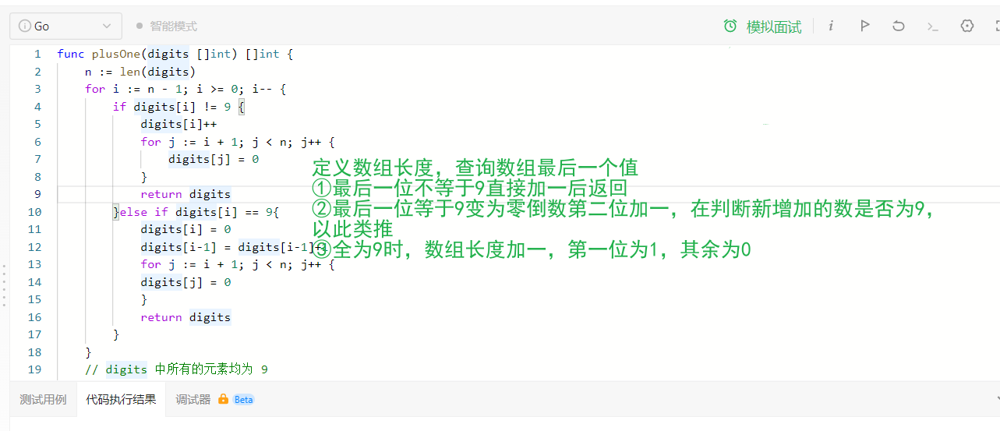

### 传送门：[66.Plus one](https://leetcode.cn/problems/plus-one/)

---
# SONGLIU
```Go
func plusOne(digits []int) []int {
    n := len(digits)
    for i := n - 1; i >= 0; i-- {
        if digits[i] != 9 {
            digits[i]++
            for j := i + 1; j < n; j++ {
                digits[j] = 0
            }
            return digits
        }
    }
    // digits 中所有的元素均为 9

    digits = make([]int, n+1)
    digits[0] = 1
    return digits
}
```

---
# LL_Yang
```Python
class Solution:
    def plusOne(self, digits: List[int]) -> List[int]:
        index = len(digits) - 1
        while True:
            # 倒着循环插入，只要不是9就停止插入
            if digits[index] != 9:
                digits[index] += 1
                break
            else:
                # 头部为9 的情况，头插一位
                if index == 0:
                    digits[index] = 0
                    digits.insert(0, 0)
                else:  # 非头部为0 ，指针进位
                    digits[index] = 0
                    index -= 1
        return digits
```


